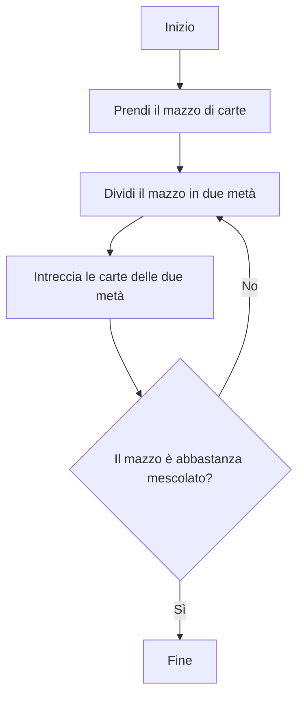
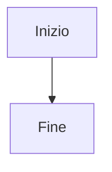
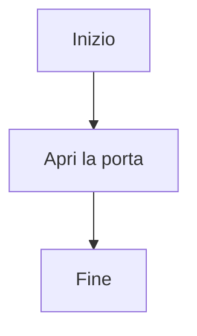
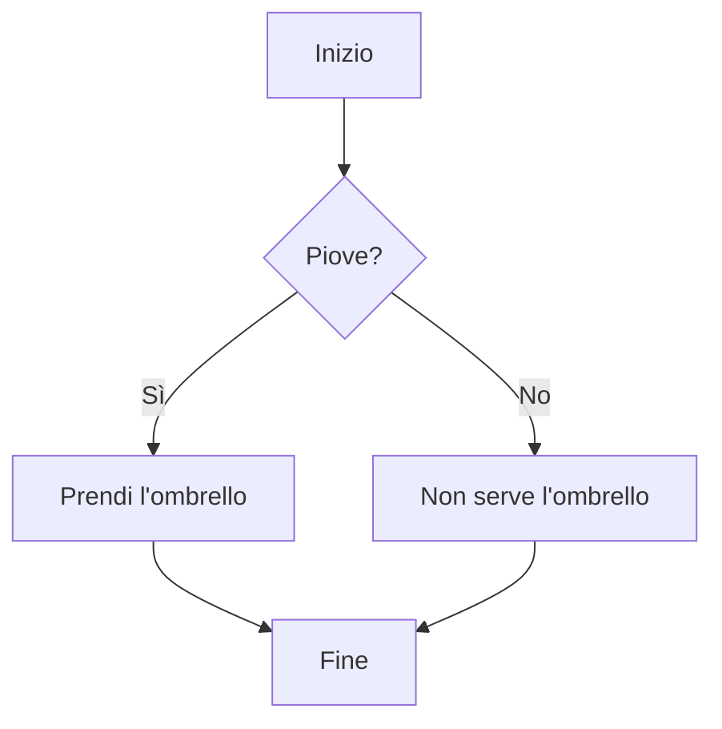
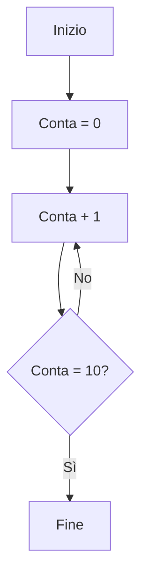

# Lezione 1: Introduzione alla Programmazione

## Cos'è un computer?

**Domanda di discussione:** Secondo te, cos'è un computer?

### Cose che SONO computer:
- Smartphone
- Tablet
- Laptop
- Computer desktop
- Smart TV
- Console per videogiochi (PlayStation, Xbox, Nintendo Switch)
- Calcolatrice
- Smartwatch
- Computer dell'auto
- Robot

### Cose che NON SONO computer:
- Telecomando della TV
- Sveglia digitale
- Lampadina LED
- Spazzolino elettrico
- Forno a microonde
- Ventilatore elettrico
- Termometro digitale
- Caricabatterie

### La Differenza Principale

**Un computer può essere programmato** - puoi insegnargli a fare cose nuove.

**Altri dispositivi elettronici** possono fare solo ciò per cui sono stati costruiti.

Esempio: Una calcolatrice può fare solo calcoli matematici. Un computer può fare calcoli matematici E giocare E modificare video E qualsiasi altra cosa per cui lo programmi.

---

## Algoritmi e Diagrammi di Flusso

Un **algoritmo** è una sequenza di istruzioni per risolvere un problema.

Un **diagramma di flusso** (flowchart) è un modo per disegnare un algoritmo.

### Esempio 1: Mescolare un mazzo di carte

**Nota:** Questo algoritmo si ripete (torna indietro) finché il mazzo non è abbastanza mescolato.

### I Nodi del Diagramma di Flusso

I diagrammi di flusso usano forme diverse per cose diverse:

#### 1. Inizio/Fine - Forma rettangolare `[...]`
- Dove inizia e finisce l'algoritmo

#### 2. Azione - Forma rettangolare `[...]`
- Un passo da eseguire

#### 3. Decisione - Forma a rombo `{...}`
- Una domanda con risposta Sì/No
- L'algoritmo va in direzioni diverse in base alla risposta

#### 4. Ciclo (Loop) - Quando una freccia torna indietro
- Ripete dei passi finché una condizione non è vera

