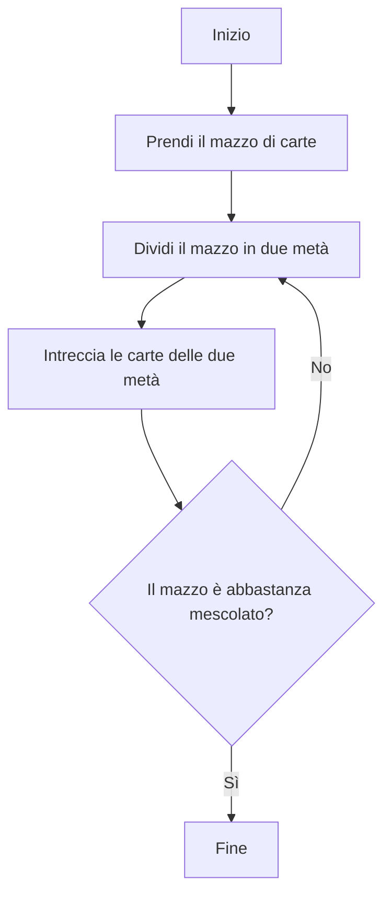
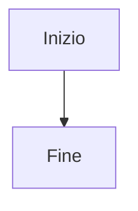
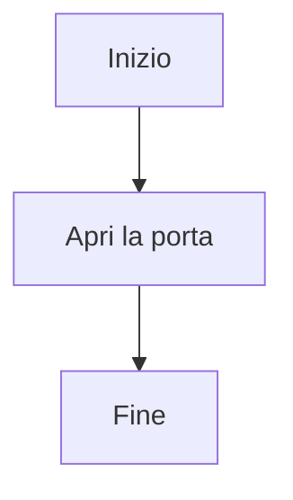
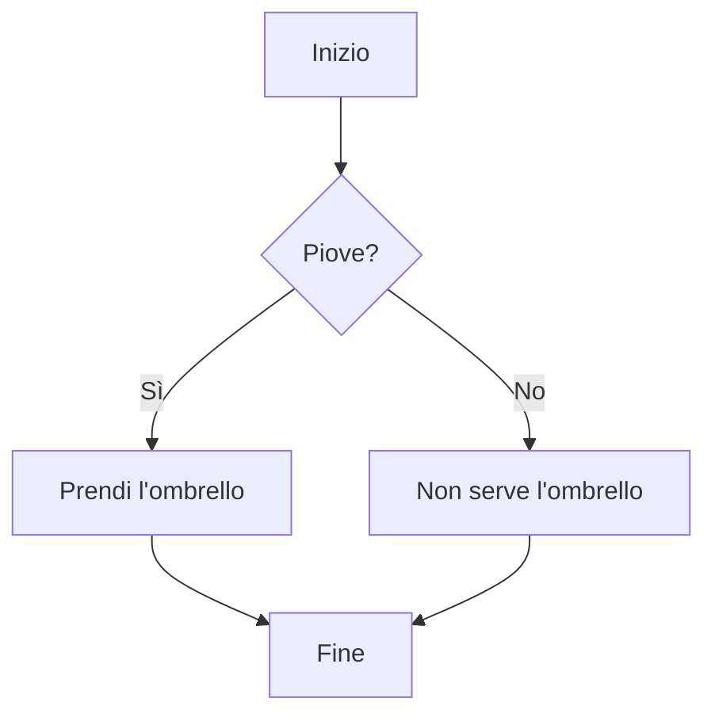
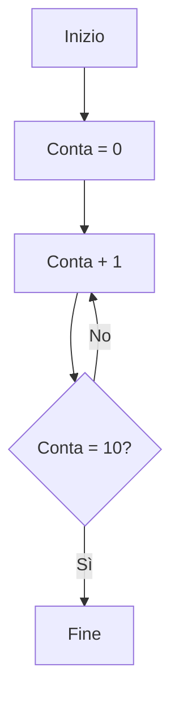

Un **algoritmo** è una sequenza di istruzioni per risolvere un problema.

Un **diagramma di flusso** (flowchart) è un modo per disegnare un algoritmo.

### Esempio 1: Mescolare un mazzo di carte

**Nota:** Questo algoritmo si ripete (torna indietro) finché il mazzo non è abbastanza mescolato.

### I Nodi del Diagramma di Flusso

I diagrammi di flusso usano forme diverse per cose diverse:

#### 1. Inizio/Fine - Forma rettangolare `[...]`
- Dove inizia e finisce l'algoritmo

#### 2. Azione - Forma rettangolare `[...]`
- Un passo da eseguire

#### 3. Decisione - Forma a rombo `{...}`
- Una domanda con risposta Sì/No
- L'algoritmo va in direzioni diverse in base alla risposta

#### 4. Ciclo (Loop) - Quando una freccia torna indietro
- Ripete dei passi finché una condizione non è vera

