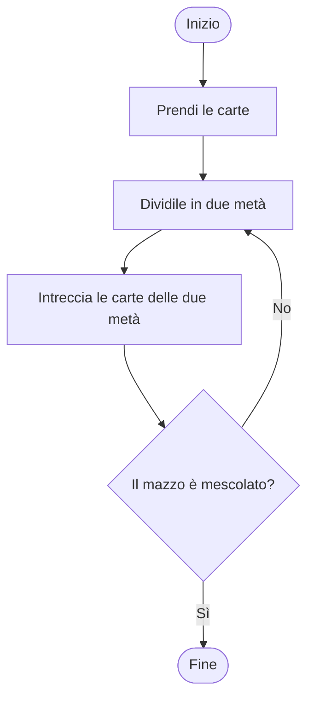
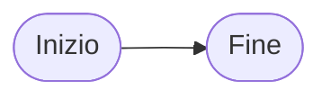
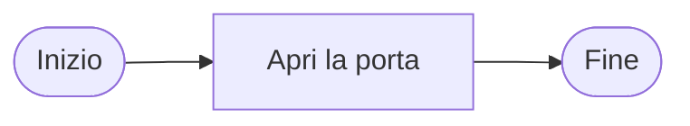
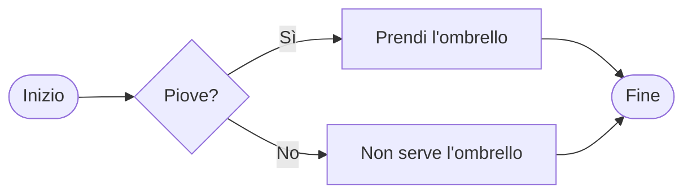
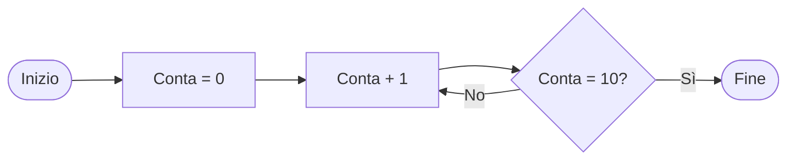

Un **algoritmo** è una sequenza di istruzioni per risolvere un problema.

Un **diagramma di flusso** (flowchart) è un modo per disegnare un algoritmo.

### Esempio: Mescolare un mazzo di carte

**Nota:** Questo algoritmo si ripete (torna indietro) finché il mazzo non è abbastanza mescolato.

### I Nodi del Diagramma di Flusso

I diagrammi di flusso usano forme diverse per cose diverse:

#### 1. Inizio/Fine - Forma ovale/arrotondata
- Dove inizia e finisce l'algoritmo

#### 2. Azione - Forma rettangolare
- Un passo da eseguire

#### 3. Decisione - Forma a rombo
- Una domanda con risposta Sì/No
- L'algoritmo va in direzioni diverse in base alla risposta

#### 4. Ciclo (Loop) - Quando una freccia torna indietro
- Ripete dei passi finché una condizione non è vera

---

## Esercizi

Prova a creare i diagrammi di flusso per questi algoritmi:

#### Esercizio 1: Preparare un panino
Crea un diagramma di flusso che descrive come preparare un panino.
Pensa a tutti i passi necessari: prendere il pane, spalmare il burro, aggiungere ingredienti, etc.

#### Esercizio 2: Attraversare la strada
Crea un diagramma di flusso per attraversare la strada in sicurezza.
Ricorda di includere una decisione: guardare se passano macchine!

#### Esercizio 3: Lavarsi i denti
Crea un diagramma di flusso che mostra come lavarsi i denti.
Include un ciclo: devi spazzolare per almeno 2 minuti!

#### Esercizio 4: Trovare un libro nella libreria
Crea un diagramma di flusso per trovare un libro specifico nella tua libreria.
Cosa fai se il libro non c'è? Includi questa decisione nel tuo diagramma.
