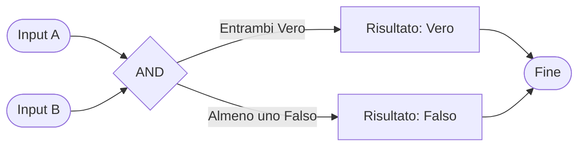

I computer ragionano usando la **logica booleana**. È un modo di pensare che usa solo due valori: **Vero** o **Falso** (in inglese: True o False).

## L'operatore AND (E)

L'operatore **AND** funziona così: il risultato è **Vero** solo se **entrambe** le cose sono vere.

### Esempio nella vita reale

"Se hai finito i compiti **E** è bel tempo, puoi uscire a giocare"

- Hai finito i compiti? = Vero **E** È bel tempo? = Vero → **Puoi uscire a giocare!**
- Hai finito i compiti? = Vero **E** È bel tempo? = Falso → **Non puoi uscire** (piove!)
- Hai finito i compiti? = Falso **E** È bel tempo? = Vero → **Non puoi uscire** (devi finire i compiti!)
- Hai finito i compiti? = Falso **E** È bel tempo? = Falso → **Non puoi uscire** (nessuna condizione soddisfatta!)

Il risultato è Vero solo se **entrambe** le condizioni sono Vere.

### Come ragiona il computer

Ecco come il computer valuta l'operazione AND:

### Tabella della Verità AND

Questa tabella mostra tutti i casi possibili:

| Input A | Input B | Risultato (A AND B) |
|---------|---------|---------------------|
| Falso   | Falso   | Falso              |
| Falso   | Vero    | Falso              |
| Vero    | Falso   | Falso              |
| Vero    | Vero    | Vero               |

**Regola semplice:** Il risultato è Vero **solo** quando A **e** B sono entrambi Veri.
