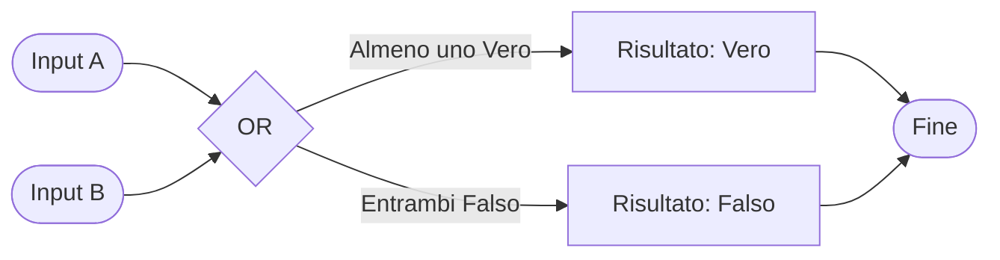

## L'operatore OR (O)

L'operatore **OR** funziona così: il risultato è **Vero** se **almeno una** delle due cose è vera.

### Esempio nella vita reale

"Se hai mangiato l'insalata **O** la zuppa, puoi mangiare il gelato"

- Hai mangiato l'insalata? = Vero → **Puoi mangiare il gelato!**
- Hai mangiato la zuppa? = Vero → **Puoi mangiare il gelato!**
- Hai mangiato entrambe? = Vero e Vero → **Puoi mangiare il gelato!**
- Non hai mangiato nessuna delle due? = Falso e Falso → **Niente gelato!**

Il risultato è Vero se **almeno una** delle due condizioni è Vera.

### Come ragiona il computer

Ecco come il computer valuta l'operazione OR:

### Tabella della Verità OR

Questa tabella mostra tutti i casi possibili:

| Input A | Input B | Risultato (A OR B) |
|---------|---------|---------------------|
| Falso   | Falso   | Falso              |
| Falso   | Vero    | Vero               |
| Vero    | Falso   | Vero               |
| Vero    | Vero    | Vero               |

**Regola semplice:** Il risultato è Vero quando **almeno uno** tra A e B è Vero.
